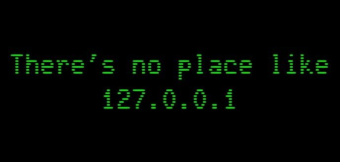

---

### About

**Student Backend Developer**

I'm a Science & Technology student at UNIFESP passionate about backend development.

Currently, I'm focused on **Java**, building projects to deepen my understanding of APIs, databases, software architecture, and scalable applications. I also explore **Go** and **Blockchain Technology** as part of my interest in modern backend ecosystems.

Outside of coding, I use **Linux (NixOS)** as my daily operating system and continuously improve my English, currently at a **B1 (CEFR) - Advanced 2** level.

 

### Technologies

---

 

### Statistics

---

 

